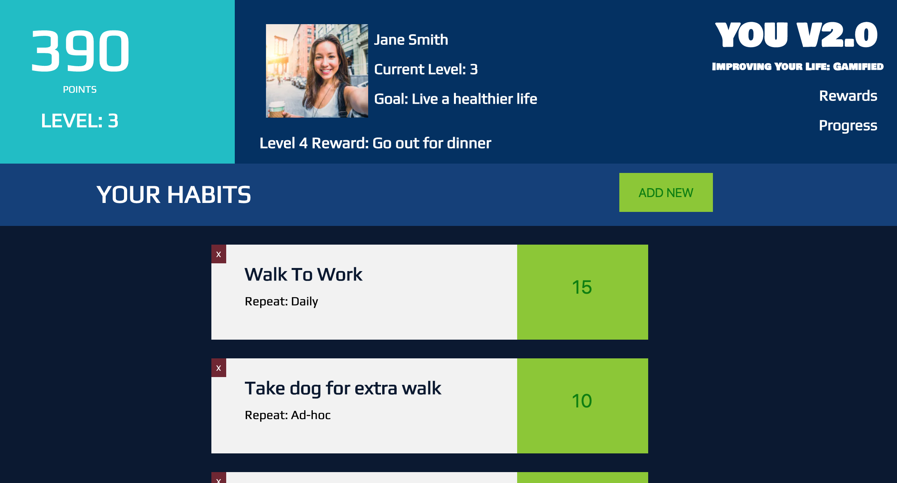
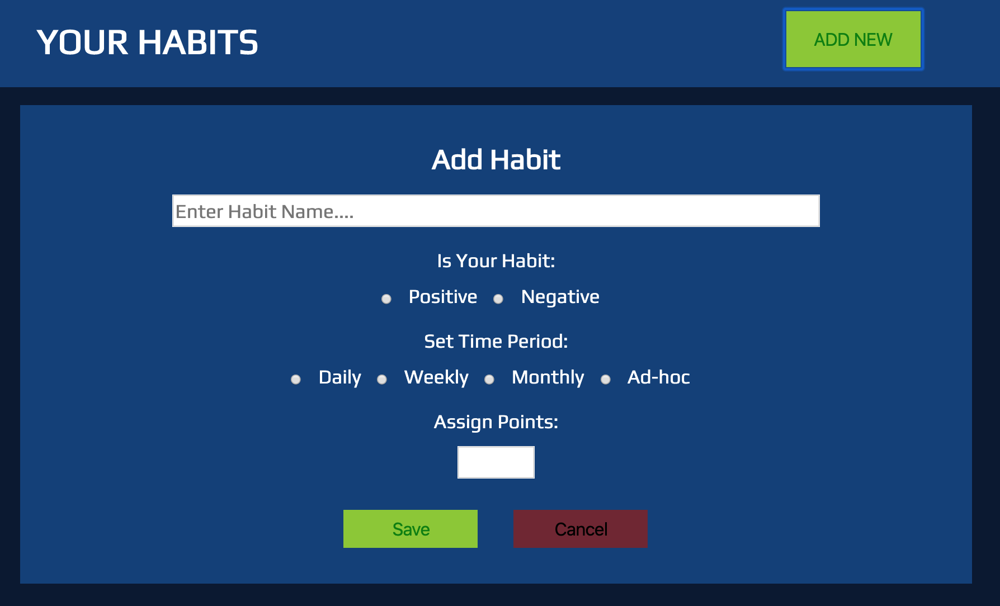
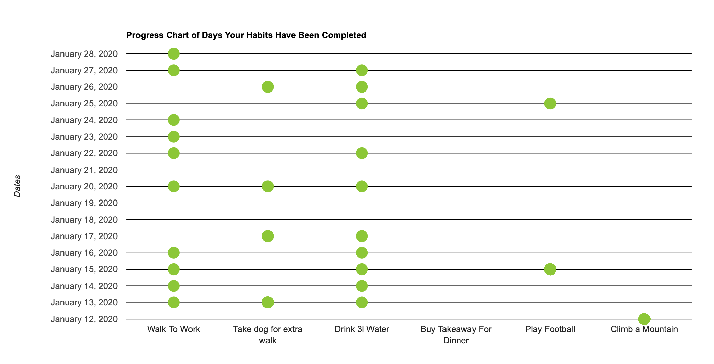

# Habit Tracker App

This project was completed during my time studying at CodeClan. The project was as part of a group of 4 and was based on JavaScript.

As a group we chose to build a Habit Tracker App from a choice of briefs (See Brief below)

Dashboard:

Create Habit:

View Progress of When Habits Were Clicked (integration with Google Charts):

## Tech:

- JavaScript
- MongoDB
- Vue.js
- Express
- Google Charts integration

## Approach:
- Initial UX session: proto-personas, user stories and user journeys. Whiteboard discussions on database and components structure.
- Used Trello board to manage project and used KANBAN style board to move user stories as they were progressed. Worked in daily development sprints over 4 days after initial planning and UX day.
- Used Mob programming initially to build an MVP that everyone understood and learned from.
- Then worked individually and in paired programming to complete additional features.
- The specific elements I was most heavily involved in were the front-end design and CSS, and integration with Google Charts to create progress charts.

## Challenges and Learnings:
- This was the first large group project we had worked on, with us potentially working separately on the same codebase. It was a great learning experience for using Git and GitHub with different branches, learning when to mob/pair/individual program, discovering our strengths and weaknesses and working together to solve problems and share ideas.
- The integration with Google Charts was a real challenge. Initially to understand how to actually integrate with Vue.js, for which I created a separate sandbox project to explore the functionality. The challenge then was to figure out how to get the data into the right format that Google Charts required, before integrating it back into the main project. We were pleased with getting it working, but given more time would like to have explored additional progress tracking charts and styling potential for Google Charts, or potentially an alternative charts tool.

## The Brief:

Nowadays everyone is trying to build or break a habit. But it's tricky to keep track of them. Identify a habit you'd like to help someone break or build (e.g. alcohol consumption, smoking, calories, exercise, healthy eating...) and make an app to help.

#### MVP
A user should be able to:

- Make CRUD entries on the front-end that are persisted on a MongoDB database on the back-end
- Display the data in visually interesting / insightful ways.

#### Example Extension:

Bring in an external API to provide nutritional info, exercises, beers etc
Handle dates elegantly - let a user filter by week, month to see progress over time

## Running Instructions

- Clone from GitHub
- In server and in client directories, run 'npm install' to install required packages
- In server directory run 'npm run seeds'
- In server directory run 'npm run server:dev'
- In client directory run 'npm run serve'
- Uses: MongoDB, express, node.js, Vue.js, nodemon
- App is loaded via localhost
